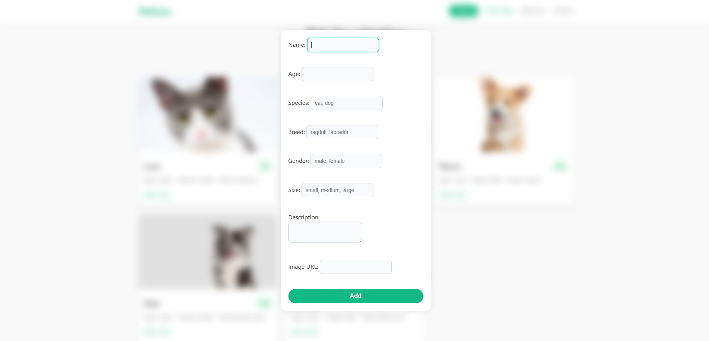

# 🐾 PetCare – Animal Adoption Platform
**PetCare** is a simple web application designed to support the adoption of pets. It allows users to browse available animals, create accounts, and add pet profiles linked to their user accounts.

⚠️ Work still in progress 

## Technologies
- Java 17
- Spring Boot
- PostgreSQL
- Maven

## Features
- Add pet profiles (linked to user accounts)
- User registration and login (users can create accounts)
- REST API endpoints  
- Clean project structure (models, services, repositories, controllers)

## How to Run
1. Ensure you have Java 17 and Maven installed

2. Clone the repo
    ```
    git clone https://github.com/aishex/PetCare.git
    cd PetCare
    ```

3. Set up the PostgreSQL database
   - Create a database named `petcare`  
   - Update your `application.properties` with your DB username and password

4. Run the project from the command line:
    ```
    mvn clean install
    mvn spring-boot:run
    ```
5. Open the app in your browser

http://localhost:8080


## 📸 Screenshots

